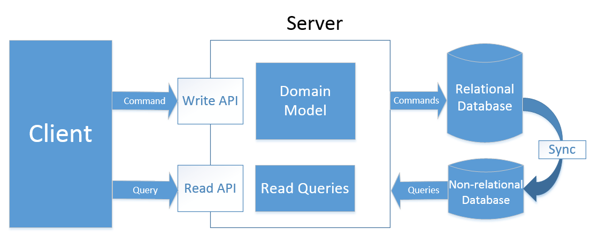

# ASP.NET Core C# — Clean Architecture, CQRS, Event Sourcing

[](https://github.com/jeangatto/ASP.NET-Core-Clean-Architecture-CQRS-Event-Sourcing/actions/workflows/dotnet.yml)
[](https://github.com/JeanGatto/ASP.NET-Core-Clean-Architecture-CQRS-Event-Sourcing/actions/workflows/sonar-cloud.yml)
[](https://github.com/jeangatto/ASP.NET-Core-Clean-Architecture-CQRS-Event-Sourcing/actions/workflows/codeql-analysis.yml)
[](https://github.com/jeangatto/ASP.NET-Core-Clean-Architecture-CQRS-Event-Sourcing/actions/workflows/devskim-analysis.yml)
[](LICENSE)

[](https://sonarcloud.io/summary/new_code?id=ASP.NET-Core-Clean-Architecture-CQRS-Event-Sourcing)
[](https://sonarcloud.io/dashboard?id=ASP.NET-Core-Clean-Architecture-CQRS-Event-Sourcing)
[](https://sonarcloud.io/dashboard?id=ASP.NET-Core-Clean-Architecture-CQRS-Event-Sourcing)
[](https://sonarcloud.io/summary/new_code?id=ASP.NET-Core-Clean-Architecture-CQRS-Event-Sourcing)
[](https://sonarcloud.io/dashboard?id=ASP.NET-Core-Clean-Architecture-CQRS-Event-Sourcing)
[](https://sonarcloud.io/dashboard?id=ASP.NET-Core-Clean-Architecture-CQRS-Event-Sourcing)
[](https://sonarcloud.io/dashboard?id=ASP.NET-Core-Clean-Architecture-CQRS-Event-Sourcing)

[](https://stars.medv.io/jeangatto/ASP.NET-Core-Clean-Architecture-CQRS-Event-Sourcing)

About the repository:
Open source project written in the latest version of ASP.NET Core, implementing the concepts of S.O.L.I.D, Clean Code,
CQRS (Command Query Responsibility Segregation)

## Give it a star! ⭐

If you liked this project, learned something, give it a star. Thank you!

## **Technologies**

- ASP.NET Core 10
- Entity Framework Core 10
- **EF Compiled Queries** (https://learn.microsoft.com/en-us/dotnet/framework/data/adonet/ef/language-reference/compiled-queries-linq-to-entities)
- Unit & Integration Tests + xUnit + FluentAssertions (7.1.0)
- xUnit (https://github.com/xunit/xunit)
- FluentAssertions (https://github.com/fluentassertions/fluentassertions)
- Polly (https://github.com/App-vNext/Polly)
- AutoMapper (https://github.com/LuckyPennySoftware/AutoMapper)
- FluentValidator (https://github.com/FluentValidation/FluentValidation)
- MediatR (https://github.com/LuckyPennySoftware/MediatR)
- Result (https://github.com/ardalis/Result)
- ~~Swagger UI~~
- OpenApi
- **Scalar** - Interactive API Reference from OpenAPI/Swagger (https://github.com/scalar/scalar)
- HealthChecks
- Microsoft SQL Server
- MongoDB
- Redis (Cache)
- Docker & Docker Compose

## **Architecture**



- Full architecture with responsibility separation concerns, SOLID and Clean Code
- Domain Driven Design (Layers and Domain Model Pattern)
- Domain Events
- Domain Notification
- Domain Validations
- CQRS
- Event Sourcing
- Unit of Work
- Repository Pattern
- Result Pattern

## Running the application

After cloning the repository to the desired folder, run the command in the terminal at the root of the project:

```csharp
dotnet clean Shop.sln --nologo /tl && dotnet build Shop.sln --nologo /tl
```

Set passwords in the `.env` file:

```yaml
MSSQL_SA_PASSWORD=YOUR_STRONG_!Passw0rd
REDIS_PASSWORD=YOUR_STRONG_!Passw0rd
MSSQL_PORT=1433
MONGO_PORT=27017
REDIS_PORT=6379
ASPNETCORE_ENVIRONMENT=Development
```

Next step, run the command in the terminal:

```csharp
docker-compose up --build
```

Now just open the url in the browser:

```csharp
http://localhost:{port}/scalar/v1
```

## MiniProfiler for .NET

To access the page with the performance indicators and performance:

```csharp
http://localhost:{port}/profiler/results-index
```

## License

- [MIT License](https://github.com/jeangatto/ASP.NET-Core-Clean-Architecture-CQRS-Event-Sourcing/blob/main/LICENSE)
