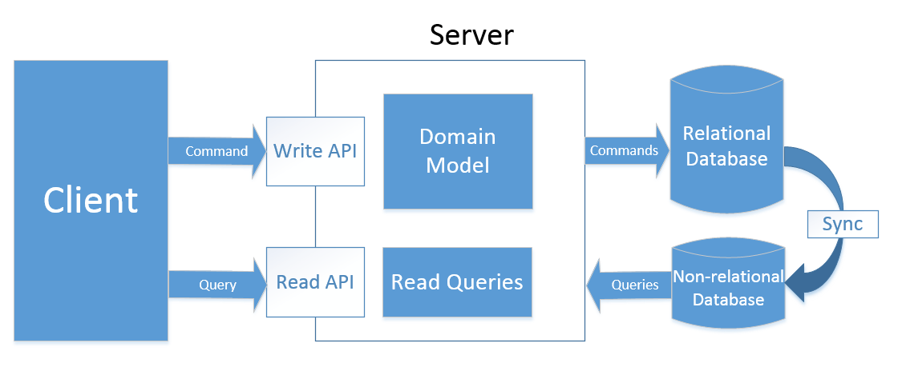

# ASP.NET Core C# — Clean Architecture, CQRS, and Event Sourcing

[](https://github.com/jeangatto/ASP.NET-Core-Clean-Architecture-CQRS-Event-Sourcing/actions/workflows/dotnet.yml)
[](https://github.com/JeanGatto/ASP.NET-Core-Clean-Architecture-CQRS-Event-Sourcing/actions/workflows/sonar-cloud.yml)
[](https://github.com/jeangatto/ASP.NET-Core-Clean-Architecture-CQRS-Event-Sourcing/actions/workflows/codeql-analysis.yml)
[](https://github.com/jeangatto/ASP.NET-Core-Clean-Architecture-CQRS-Event-Sourcing/actions/workflows/devskim-analysis.yml)
[](LICENSE)

[](https://sonarcloud.io/summary/new_code?id=ASP.NET-Core-Clean-Architecture-CQRS-Event-Sourcing)
[](https://sonarcloud.io/dashboard?id=ASP.NET-Core-Clean-Architecture-CQRS-Event-Sourcing)
[](https://sonarcloud.io/dashboard?id=ASP.NET-Core-Clean-Architecture-CQRS-Event-Sourcing)
[](https://sonarcloud.io/summary/new_code?id=ASP.NET-Core-Clean-Architecture-CQRS-Event-Sourcing)
[](https://sonarcloud.io/dashboard?id=ASP.NET-Core-Clean-Architecture-CQRS-Event-Sourcing)
[](https://sonarcloud.io/dashboard?id=ASP.NET-Core-Clean-Architecture-CQRS-Event-Sourcing)
[](https://sonarcloud.io/dashboard?id=ASP.NET-Core-Clean-Architecture-CQRS-Event-Sourcing)

## Star History

<a href="https://star-history.dera.page/#jeangatto/ASP.NET-Core-Clean-Architecture-CQRS-Event-Sourcing&type=date">
 <picture>
   <source media="(prefers-color-scheme: dark)" srcset="https://api.star-history.dera.page/svg?repos=jeangatto/ASP.NET-Core-Clean-Architecture-CQRS-Event-Sourcing&type=date&theme=dark&legend=top-left" />
   <source media="(prefers-color-scheme: light)" srcset="https://api.star-history.dera.page/svg?repos=jeangatto/ASP.NET-Core-Clean-Architecture-CQRS-Event-Sourcing&type=date&legend=top-left" />
   
 </picture>
</a>

This repository is an open-source reference implementation of ASP.NET Core using Clean Architecture, CQRS, and Event Sourcing principles. It is designed to demonstrate how to structure a production-ready solution around separation of concerns, testability, and maintainability.

## Give it a star! ⭐

If you found this project useful, please consider giving it a star. Thank you!

## Technologies

- ASP.NET Core 10
- Entity Framework Core 10
- EF Compiled Queries
- xUnit, FluentAssertions, and NSubstitute for automated testing
- Polly for resilience policies
- AutoMapper for object mapping
- FluentValidation for input validation
- MediatR for in-process messaging
- Ardalis.Result for result-based error handling
- OpenAPI and Scalar for API documentation
- Health Checks
- Microsoft SQL Server, MongoDB, and Redis
- Docker and Docker Compose
- Distroless .NET images

## Architecture



The solution is organized around a layered, domain-first design that emphasizes:

- Clear separation of responsibilities across application, domain, infrastructure, and presentation layers
- SOLID principles and clean code practices
- Domain-driven design with entities, value objects, and aggregates
- Domain events and notifications
- CQRS for separating command and query responsibilities
- Event Sourcing for persisting state transitions
- Repository and Unit of Work patterns
- Result-based handling for predictable application outcomes

## Prerequisites

Before running the application locally, make sure you have:

- .NET SDK 10
- Docker Desktop (or Docker Engine with Compose support)
- A terminal with access to the repository root

## Running the application

1. Clone the repository and navigate to the project root.
2. Restore and build the solution:

```bash
dotnet clean Shop.slnx --nologo /tl && dotnet build Shop.slnx --nologo /tl
```

3. Create a `.env` file with the required environment variables:

```yaml
MSSQL_SA_PASSWORD=YOUR_STRONG_!Passw0rd
REDIS_PASSWORD=YOUR_STRONG_!Passw0rd
MSSQL_PORT=1433
MONGO_PORT=27017
REDIS_PORT=6379
ASPNETCORE_ENVIRONMENT=Development
```

4. Start the infrastructure and application containers:

```bash
docker compose up --build
```

5. Open the API documentation in your browser:

```text
http://localhost:{port}/scalar/v1
```

## Unit Testing

This repository uses a layered testing strategy to keep the solution reliable while preserving the principles of Clean Architecture and CQRS.

- Unit tests are located in [tests/Shop.UnitTests](tests/Shop.UnitTests) and focus on domain entities, value objects, validators, handlers, queries, and mapping logic.
- Integration tests are located in [tests/Shop.IntegrationTests](tests/Shop.IntegrationTests) and cover API and infrastructure behavior.

### Test stack

The unit test project in [tests/Shop.UnitTests/Shop.UnitTests.csproj](tests/Shop.UnitTests/Shop.UnitTests.csproj) uses:

- xUnit for test execution
- FluentAssertions for readable assertions
- NSubstitute for dependency mocking
- Coverlet for coverage reporting
- Microsoft.EntityFrameworkCore.Sqlite for database-backed tests

### How to run tests

From the repository root, run:

```bash
dotnet test tests/Shop.UnitTests/Shop.UnitTests.csproj
```

To run the full solution test suite:

```bash
dotnet test Shop.slnx
```

To run a subset of tests by name:

```bash
dotnet test tests/Shop.UnitTests/Shop.UnitTests.csproj --filter "FullyQualifiedName~CreateCustomer"
```

### Example test case

A typical unit test follows the xUnit and FluentAssertions pattern used throughout the project:

```csharp
public class CreateCustomerCommandValidatorTests
{
    [Fact]
    public void Validate_Should_Fail_When_EmailIsInvalid()
    {
        var validator = new CreateCustomerCommandValidator();
        var command = new CreateCustomerCommand("Jane Doe", "invalid-email");

        var result = validator.Validate(command);

        result.IsValid.Should().BeFalse();
        result.Errors.Should().ContainSingle(e => e.PropertyName == "Email");
    }
}
```

### Best practices for CQRS and Event Sourcing

- Keep unit tests fast and isolated; prefer deterministic inputs and small collaborators over full infrastructure dependencies.
- Test command, query, validator, and domain aggregate behavior directly rather than relying on implementation details.
- For CQRS, verify that handlers and validators produce the expected results and side effects.
- For Event Sourcing, assert that domain events are emitted correctly and that aggregates can be reconstructed from historical events.
- Use descriptive test names so failures clearly communicate what behavior broke.

## MiniProfiler for .NET

To inspect performance traces while the application is running, open:

```text
http://localhost:{port}/profiler/results-index
```

## License

- [MIT License](https://github.com/jeangatto/ASP.NET-Core-Clean-Architecture-CQRS-Event-Sourcing/blob/main/LICENSE)
